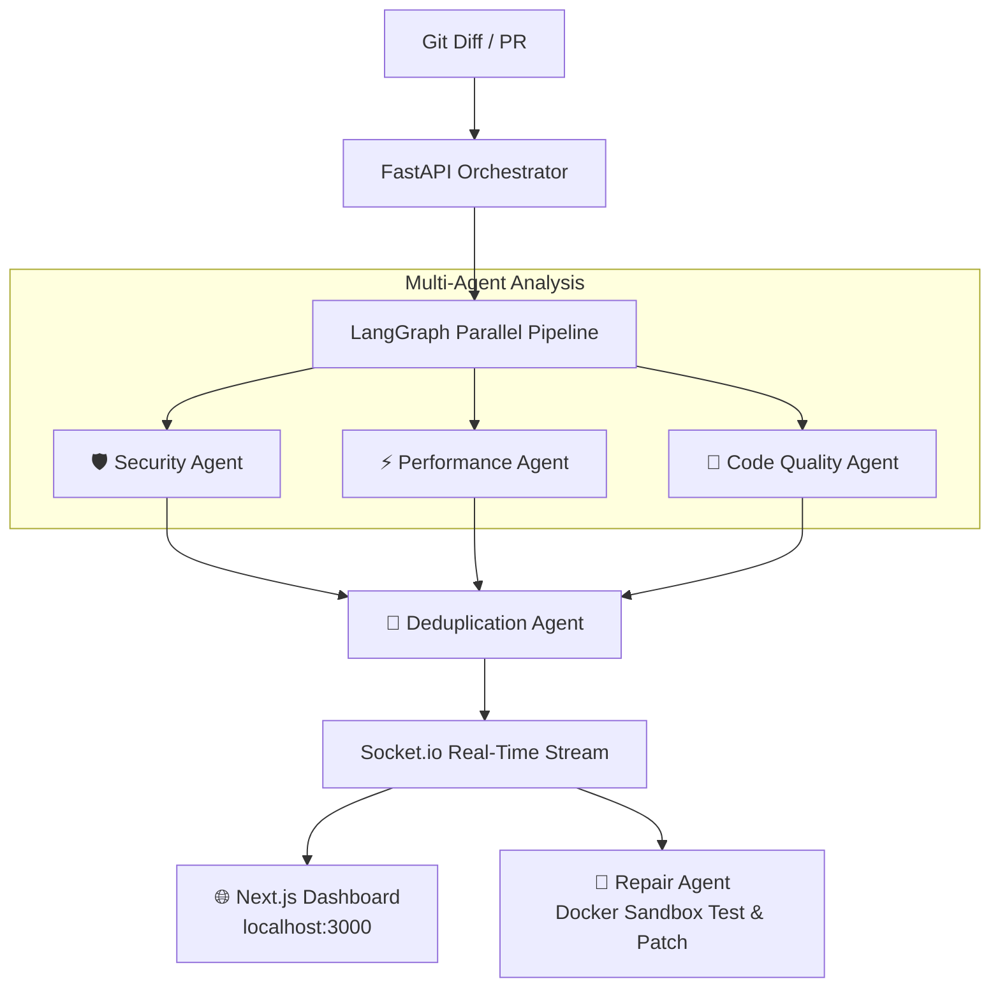

<div align="center">

# 🫀 Pulse (`pulse-agent`)

### Autonomous Multi-Agent DevOps & Code Review System

**AI-powered PR & Diff Code Review · Automated Docker Repair · Real-Time Dashboard**

[](LICENSE)
[](https://www.npmjs.com/package/pulse-agent)
[](https://www.python.org/downloads/)
[](https://nodejs.org/)

</div>

---

**Pulse** is an open-source, autonomous multi-agent code review and DevOps system. Powered by **[LangGraph](https://github.com/langchain-ai/langgraph)**, Pulse coordinates specialized AI agents that review your code in parallel before it merges, patches bugs inside an isolated Docker sandbox, and streams live diagnostics to an interactive web dashboard.



---

## ✨ Why Pulse?

- **🔍 Multi-Agent Review Pipeline** — Specialized **Security**, **Performance**, and **Code Quality** agents evaluate every change concurrently, eliminating noisy single-prompt hallucinations.
- **🧠 3-Stage Smart Deduplication** — Automatically detects semantic duplicates, subsumes redundant findings under file deletions, and merges overlapping context edits so patches apply cleanly without source-code conflicts.
- **⚡ CLI-First (`pulse-agent`)** — Install once via npm (`npm install -g pulse-agent`) and run `pulse start` anywhere. Pulse automatically creates and caches a Python 3.11+ virtual environment (`.pulse/.venv/`) with zero manual setup.
- **🔧 Automated Docker Repair** — When a critical issue is found, Pulse boots an isolated Docker container, applies the fix, executes tests, and verifies the patch before presenting it to you.
- **📊 Interactive Web Dashboard** — A modern React 19 / Next.js real-time UI showing live neural agent thinking, severity filtering (**Critical**, **Warning**, **Info**), and one-click patch application.

---

## 🚀 Quickstart

### 1. Install Globally

Install the Pulse CLI from npm:

```bash
npm install -g pulse-agent
```

> **Prerequisites:** Requires **Node.js 18+** and **Python 3.11+** installed on your system.

### 2. Initialize Your Project

Navigate to any Git repository on your machine and run:

```bash
cd /path/to/your-project
pulse init
```

The interactive wizard will:
- Let you choose your preferred LLM provider (**Anthropic**, **OpenAI**, or **Groq**) and securely store your API key.
- Optionally configure your **GitHub token** for remote pull request reviews.
- Create a `.pulse/config.json` configuration file in your project directory.
- Automatically add `.pulse/` to your `.gitignore`.

### 3. Start Pulse

```bash
pulse start
```

This launches both the **Python Orchestrator Backend** (`http://localhost:8000`) and the **Interactive Web Dashboard** (`http://localhost:3000`) in the background.

> [!TIP]
> On first boot, Pulse automatically configures an isolated Python virtual environment at `.pulse/.venv/` and caches requirements so subsequent launches take under a second.

---

## 🛠️ CLI Reference (`pulse`)

| Command | Description |
|---|---|
| `pulse init` | Interactive wizard to configure API keys and preferences for the project |
| `pulse start` | Boot the Pulse backend orchestrator (`:8000`) and UI dashboard (`:3000`) |
| `pulse review` | Run an AI review on your local staged/unstaged `git diff` |
| `pulse review --pr owner/repo#123` | Analyze a remote GitHub Pull Request |
| `pulse status` | Check the live health and port status of all Pulse components |
| `pulse stop` | Gracefully shut down background Pulse servers |

---

## 🌐 Real-Time Dashboard

When Pulse is running, open your browser to **[http://localhost:3000](http://localhost:3000)**:

- **Live Agent Pipeline:** Monitor Security, Performance, and Quality agents streaming structured findings via Socket.io.
- **Severity & File Filtering:** Quickly hone in on **Critical** vulnerabilities or browse recommendations file-by-file.
- **Interactive Patch Review:** Inspect diffs generated by the Docker Repair sandbox and apply them to your working tree.

---

## 🏗️ Monorepo Architecture

```
pulse/
├── packages/
│   ├── orchestrator/    # FastAPI + LangGraph Multi-Agent Backend (Python 3.11+)
│   ├── dashboard/       # Next.js Real-Time UI (React 19 + Standalone Build)
│   └── cli/             # npm CLI Package (Commander.js + Lifecycle Manager)
├── docs/
│   └── agent-prompts/   # Versioned System Prompts for AI Agents
├── infra/
│   └── k8s/             # Kubernetes Deployment Manifests
└── package.json         # Monorepo Root
```

---

## 💻 Developing & Contributing

To develop Pulse locally or run from source:

```bash
# 1. Clone the repository
git clone https://github.com/yourusername/pulse.git
cd pulse

# 2. Install dependencies
npm install

# 3. Build dashboard and CLI
npm run build:dashboard
npm run build:cli

# 4. Link CLI globally for development
cd packages/cli
npm link

# 5. Run dev servers
npm run dev
```

---

## 🗺️ Roadmap & Progress

| Phase | Status | Description |
|---|---|---|
| 1. Orchestrator Skeleton | ✅ | FastAPI + webhook receiver + Socket.io |
| 2. Security Agent (E2E) | ✅ | First agent: diff in → findings out → PR comment |
| 3. Multi-Agent Wiring | ✅ | LangGraph parallel fan-out to Security, Performance, and Quality agents |
| 4. Repair Agent + Sandbox | ✅ | Docker-based automated fix attempts and code patch generation |
| 5. 3-Stage Deduplication | ✅ | Cross-agent conflict resolution, semantic dedup, and patch overlap merging |
| 6. Dashboard | ✅ | Next.js real-time UI with live neural graph and findings feed |
| 7. CLI Packaging | ✅ | `pulse-agent` npm CLI (`pulse start`, `pulse review`, etc.) |
| 8. Sentinel + Self-Healing | ⬜ | Kubernetes cluster monitoring (stretch goal) |

---

## 🤝 Contributing

Contributions are welcome! Please read the [contributing guidelines](CONTRIBUTING.md) before submitting a PR.

## 📄 License

MIT — see [LICENSE](LICENSE) for details.